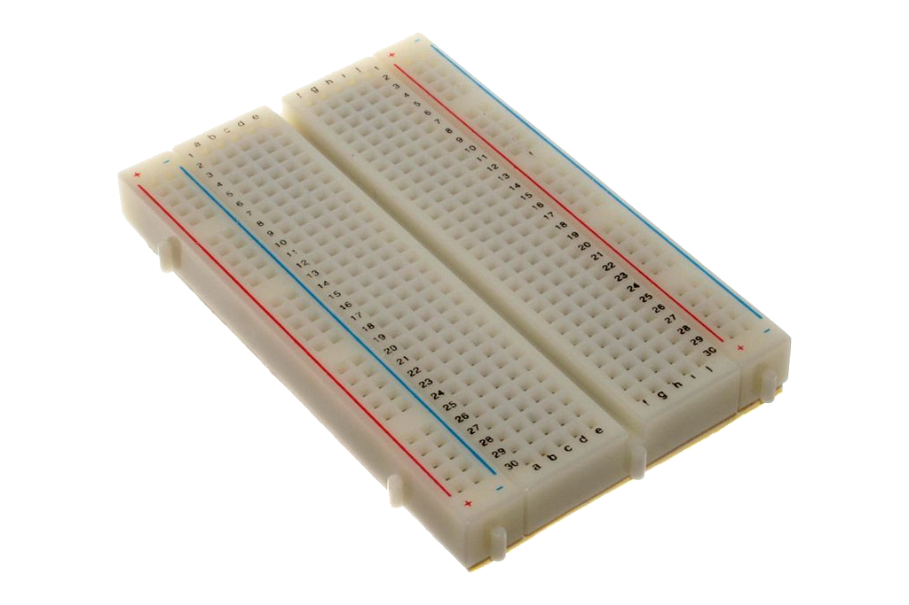
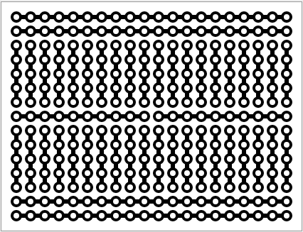
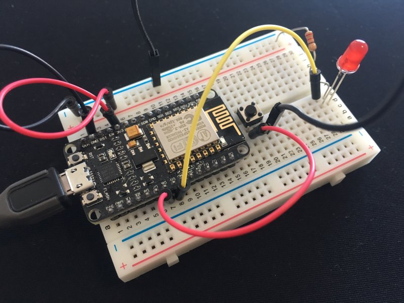

# The Breadboard
The breadboard is used to wire our components together.

Image attribution: [CC BY-SA 2.0](https://commons.wikimedia.org/wiki/File:400_points_breadboard.jpg)

## Wiring scheme

Image attribution: [CC BY-SA 3.0](https://commons.wikimedia.org/wiki/File:Breadboard_scheme.svg)

## How it is used

## Reference
  * https://en.wikipedia.org/wiki/Breadboard
