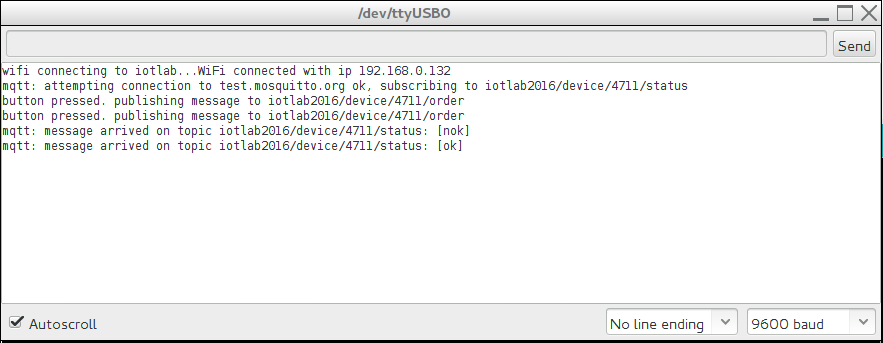

## IoT-Lab: Debugging

To debug the firmware, we can use the `serial monitor` of the Arduino-IDE. The serial monitor allows displaying output generated with the print-methods of the `Serial` class in a sketch.

``` c++
/*
 * example usage of Serial class for Debugging
 */
void setup() {
  // speed of serial port must be set
  Serial.begin(9600);
  // print some text
  Serial.println("entering setup.");
}
...
```

