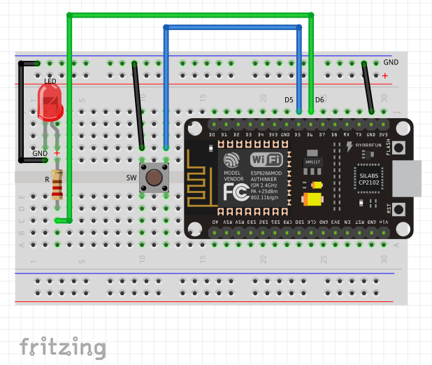

# IoT-Lab: Hardware setup
We are now ready to build our ordering button device and develop our first program (*sketch*) for it.

To quickly wire everything up, we again use the [Breadboard](Breadboard.md) and extend the circuit from the [Hello, World!](HelloWorld.md) excercise.

<!-- MDTOC maxdepth:6 firsth1:2 numbering:0 flatten:0 bullets:1 updateOnSave:1 -->

- [List of parts](#list-of-parts)   
- [Wiring diagram](#wiring-diagram)   

<!-- /MDTOC -->
## List of parts
The ordering button device just needs a handful of components:
  * a [Breadboard](Breadboard.md) for mounting components
  * [NodeMCU](https://en.wikipedia.org/wiki/NodeMCU) [compatible](http://frightanic.com/iot/comparison-of-esp8266-nodemcu-development-boards/) prototyping board with ESP8266 micro controller
  * a switch/push button (SW)
  * a [LED](https://en.wikipedia.org/wiki/Light-emitting_diode) and [resistor](https://en.wikipedia.org/wiki/Resistor) (R)
  * some cables for patching the components together

## Wiring diagram
Now we add a push button to the circuit we created during the `Hello, world!` excercise. Connect the button to pin `D5`.

---
Next: [set up the firmware for the ordering button](Firmware_Development.md)
