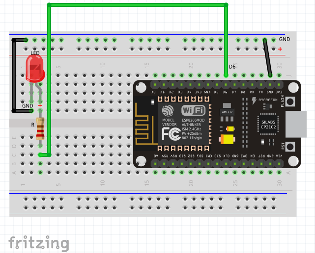

# IoT-Lab: *Hello, world!*
Now that everything is set up, it's time for a first test. We will run our first sketch: the embedded version of the famous "Hello, world!", which will let an [LED](https://en.wikipedia.org/wiki/Light-emitting_diode) connected to the NodeMCU board blink.

<!-- MDTOC maxdepth:6 firsth1:2 numbering:0 flatten:0 bullets:1 updateOnSave:1 -->

- [Hardware - setting up the wiring for `Hello, world!`](#hardware-setting-up-the-wiring-for-hello-world)   
- [List of parts](#list-of-parts)   
- [Wiring diagram](#wiring-diagram)   
   - [Notes](#notes)   
- [Software](#software)   
   - [What is a sketch?](#what-is-a-sketch)   
   - [Anatomy of a sketch](#anatomy-of-a-sketch)   
- [`Hello, world!` Instructions](#hello-world-instructions)   
- [The `Hello, world!` sketch](#the-hello-world-sketch)   
- [Bonus](#bonus)   

<!-- /MDTOC -->

## Hardware - setting up the wiring for `Hello, world!`
Before we start, some security precautions:
  * disconnect the NodeMCU from the USB cable whenver you are going to change the circuit
  * don't forget the resistors when connecting an LED to the board -- otherwise the hardware may be damaged!

Using the [breadboard](Breadboard.md), NodeMCU, LED, resistor and patch cables, set up the wiring according to the following diagram:

## List of parts
The `Hello, World!` sketch will use the following components:
  * a [Breadboard](Breadboard.md) for mounting components
  * [NodeMCU](https://en.wikipedia.org/wiki/NodeMCU) [compatible](http://frightanic.com/iot/comparison-of-esp8266-nodemcu-development-boards/) prototyping board with ESP8266 micro controller
  * a [LED](https://en.wikipedia.org/wiki/Light-emitting_diode) and [resistor](https://en.wikipedia.org/wiki/Resistor) (R)
  * some cables for patching the components together

## Wiring diagram
  

  * Connect the LED to pin `D6`

### Notes
  * a LED has a polarity. The longer of the two legs must be connected to positive voltage (+), the other one to ground ([GND](https://en.wikipedia.org/wiki/Ground_(electricity)))
  * double check your circuit before proceeding with the firmware development.

## Software
To start the LED blink, we need to write some software, a so called `sketch`.

### What is a sketch?
A `sketch` is a program (firmware) for an Arduino or similar micro controller. Sketches are written using the Arduino IDE.

### Anatomy of a sketch
A sketch is written in C++ and has always the same structure, consisting of
  * a `setup()` function, which is called once, when the sketch starts, and
  * a `loop()` function, which is run over and over again, and executing the main program logic.

``` c++
void setup() {
  /* put one-time initializations here */
}

void loop() {
  /* this function is run over and over again */
}
```

## `Hello, world!` Instructions
  * connect the NodeMCU with the USB cable to your computer
  * start the Arduino-IDE
  * make sure that under `Tools > Board` the `NodeMCU 1.0 (ESP-12E Module)` board is selected
  * make sure that under `Tools > Port` the right port is selected (e.g. `/dev/ttyUSB0` or `COM4`)
  * enter or copy the `Hello, World!` sketch from below into the editor window
  * click the `Upload` button. This will compile the sketch and on success upload it to the board.
  * on success, the builtin LED of the board will start to blink. Note that the code is executed by the micro controller. Once the sketch development is done and the firmware is uploaded to the micro controller, the host PC is no longer needed (provided that the micro controller is connected to a power supply).

## The `Hello, world!` sketch
  * copy the code into the the Arduino IDE
  * fix the part marked with `/* FIXME */`. Hint: the available GPIO pins of the board are available as pre defined constants like `D0`, `D1` etc.
  * select `Verify/Compile` and then `Upload` from the Sketch Menu.

``` c++
/*
 * "Hello, world!" - embedded version.
 * let the built-in LED of the NodeMCU board blink
 */
const int LED_PIN = /* FIXME */;

void setup() {
    pinMode(LED_PIN, OUTPUT);
}

void loop() {
  digitalWrite(LED_PIN, LOW);
  delay(500);
  digitalWrite(LED_PIN, HIGH);
  delay(500);
}
```
## Bonus
  * modfiy the values passed to the `delay()` function and test the effect of very small values (see also [PWM](https://www.arduino.cc/en/Tutorial/PWM))

***
Next: We made sure that everything is up and running. [Now set up the hardware for the ordering button.](Hardware_Setup.md)
