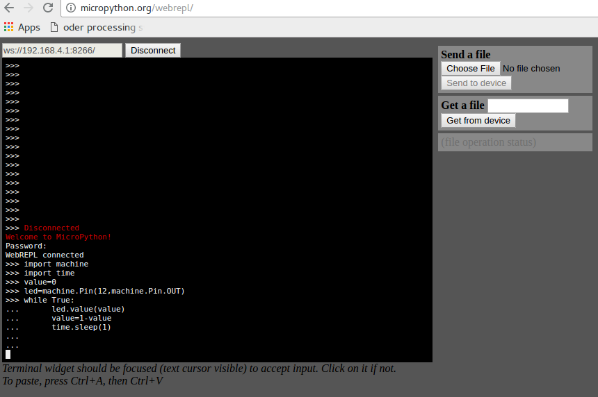

# IoT-Lab: MicroPython demo
MicroPython is an implementation of the popular Python language for micro controllers. The python interpreter runs directly on the micro controller and can be used interactively: Using the MicroPython image, we can direclty access a Python REPL (Read-Evaluate-Print-Loop) running on the NodeMCU using a web browser. No USB connection is needed, commands are directly evaluated by the interpreter running on the board.

## Preparation
### Flashing MicroPython
  * Download MicroPython image: http://micropython.org/download#esp8266
  * Flash the image using [esptool.py](https://github.com/espressif/esptool)
```
$ ./esptool.py --port /dev/ttyUSB0   write_flash --flash_size 32m 0 esp8266-20161017-v1.8.5.bin
```

## Accessing the Web REPL
### Activating the Web REPL (one time)
```
$ screen /dev/ttyUSB0
>>> import webrepl
>>> webrepl.start()
WebREPL daemon started on ws://192.168.4.1:8266
Started webrepl in setup mode
```
### Accessing the Web REPL using a web browser
* Open the client   [http://micropython.org/webrepl/](http://micropython.org/webrepl/)
* Connect to WiFi Accesspoint  `MicroPython-xxxxxx` with the password `micropythoN`.
* Click `connect`  
* set a password as instructed, reconnect.

Now you should be able to enter and evaluate Python code.

## MicroPython version of `Hello, World!`
The LED is to be connected to GPIO D6.
```Python
import machine
import time
value=0
led=machine.Pin(12,machine.Pin.OUT)
while True:
  led.value(value)
  value=1-value
  time.sleep(1)
```

