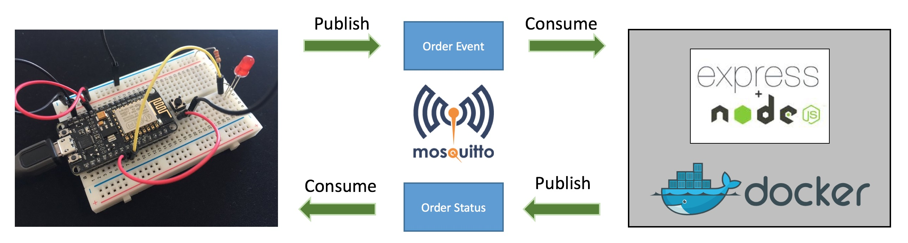

# Welcome to the IoT-Lab!


<!-- MDTOC maxdepth:6 firsth1:2 numbering:0 flatten:0 bullets:1 updateOnSave:1 -->

- [Introduction](#introduction)   
- [Structure of the Lab](#structure-of-the-lab)   
- [Repository layout](#repository-layout)   

<!-- /MDTOC -->

## Introduction

The IoT-Lab will demonstrate in a hands-on manner some basics of the Internet-of-Things (IoT). Using an [ESP8266  MCU](https://en.wikipedia.org/wiki/ESP8266), we will build an internet-connected device, which will be similar in it's functionality to the [Amazon Dash Button](https://en.wikipedia.org/wiki/Amazon_Dash). The following topics will be covered by the lab:
  * Wiring of the ESP8266 micro controlling unit and passive components (LED, button, resistor) using a breadboard.
  * Programming of the ESP8266 micro controlling unit using C++ and the [Arduino IDE](https://www.arduino.cc/en/Main/Software)
  * Basics of the [MQTT](https://en.wikipedia.org/wiki/MQTT) communication protocol

## The big picture

The solution consists of 3 major blocks:
  * the **device**: when the customer presses the hardware button, an **order event** is generated which signals that the customer wants to order the good associated with the device.
  * the **order service**: the _backend_/_server-side_ service which consumes the **order event** and processes the order. The order service notifies the device about the **order status** which is visualized for the user through a LED. The order service is built with [Express](http://expressjs.com/), a web framework for the event-driven I/O server-side JavaScript environment [Node.js](https://nodejs.org/en/).
  * the **messaging infrastructure**: middleware which facilitiates the exchange of messages between the device and the order service based on the [publish-subscribe pattern](http://www.hivemq.com/blog/mqtt-essentials-part2-publish-subscribe).



The main focus in this lab is the **device**. We will set up the hardware consisting of a NodeMCU prototyping board, LEDs and switches and develop a firmware which is able to:
 * detect a button press
 * connect to the messaging infrastructure
 * send a message
 * consume a message
 * control a LED

The message infrastructure and the order service will not be built as part of this lab but are available as ready to use components and will be integrated.

## Structure of the Lab

  1. [Check the prerequisites and set up your computer](LabPrerequisites.md) ( [Windows/Mac OS X specific](ArduinoIDE_Windows.md), [Linux specific](ArduinoIDE_Linux.md), [general instructions for all platforms](ArduinoIDE_ESP8266_configuration.md))
  2. Start with the [Hello, world!](HelloWorld.md) sketch
  3. [Set up our hardware device, the ordering button](Hardware_Setup.md)
  4. [Implement the firmware for the device](Firmware_Development.md)
  5. [Testing](Testing.md) and [Debugging](Debugging.md) of the firmware.
  6. [Closing words](Closing_Word.md)

## Repository layout
  ```
    +--doc                   project documentation
    +--src                   source folder
       +--order-service      demonstrative micro service for order processing
       +--sketches           sketches for ESP8266 - copy contents to Arduino directory.
          +--hello_world     "hello, world!" sketch
          +--order_button    sketch for the order button
  ```

---
Next: [Check prerequisites for the Lab](LabPrerequisites.md)
