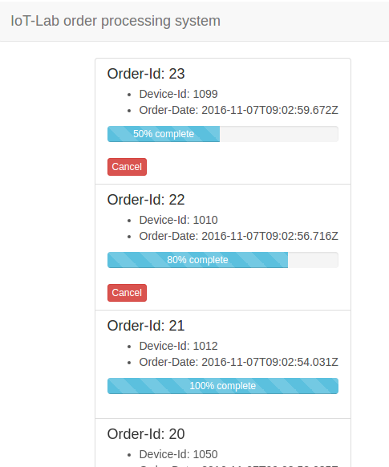

# IoT-Lab: testing the device

<!-- MDTOC maxdepth:6 firsth1:2 numbering:0 flatten:0 bullets:1 updateOnSave:1 -->

- [Tests to perform](#tests-to-perform)   
- [The order processing system](#the-order-processing-system)   

<!-- /MDTOC -->

## Tests to perform
1. **Turn on/reset the device**.
2. **Wait until the WiFi connection is established**.
   * The device will automatically try to connect to the configured Wifi. While connecting, the built-in LED blinks with a [frequency](https://en.wikipedia.org/wiki/Frequency) of 1Hz and a [duty cycle](https://en.wikipedia.org/wiki/Duty_cycle) of 50% (500ms on, 500ms off, 500ms on, ...).  After successful connection, the built-in LED is turned off.
3. **Press the button to capture a new order**.
    * **the feedback LED is turned on for 250 milliseconds**. This indicates to the user that the button-press was recognized by the device and a new order has been sent to the lab-provided *order processing system*.
    * **if there is no other order for the device** currently beeing processed, you should now see the new order coming up in the web interface of the lab-provided *order processing system*. After the order has been processed (virtually):
      * a positive acknowledgement is sent from the lab-provided *order processing system* to the device and
      * the device turns on the feedback LED for 2 seconds to indicate to the user feedback that the order has been successfully processed.
    * **if however there is already an order** being processed for the device at the moment then no new order will be created by the lab-provided *order processing system*. In this case
      * a negative acknowledgement is sent from the lab-provided *order processing system* to the device and
      * the device turns on and off the feedback LED 5 times with a frequency of 5Hz and a duty cycle of 50% (100ms on, 100ms off, 100ms on, ..) to indicate to the user that the order has been rejected.

[Look here for some information on how to debug the sketch](Debugging.md).

## The order processing system
The lab provides a micro service to view the status of the orders in real time.

---
Next: [Closing words](Closing_Words.md)
